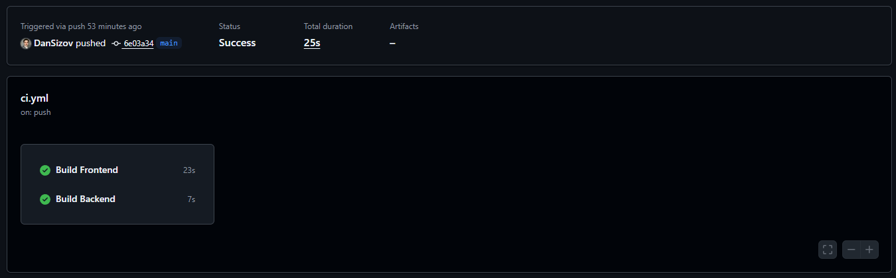
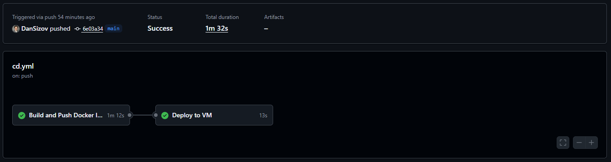
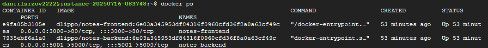

# App manual deployment:

1. Create a **VM** in **GC Compute Engine**. Make sure **http traffic** is allowed in **Networking**.
2. Create a firewall rule with target tag `notes-app`, add `0.0.0.0/0` to **IPv4 ranges** and allow `3000,5001` ports. Apply this tag in **VM's settings**.
3. Install **Docker** on the **VM** and create a **network**.
4. Pull and run **BE**, **FE**:

```
docker pull dlippo/devopscourse-notes-backend:latest
docker run -d --name notes-backend --network notes-network -p 5001:5000 dlippo/devopscourse-notes-backend:latest

docker pull dlippo/devopscourse-notes-frontend:latest
docker run -d --name notes-frontend --network notes-network -p 3000:80 dlippo/devopscourse-notes-frontend:latest
```

The result should be identical to the images below


# App CI/CD:

## CI Workflow

**Triggers**

- `push` to the `main` branch
- `pull_request` targeting `main`

**Steps**

1. **Build Frontend**
   - Checkout code
   - Install dependencies (`frontend/`)
   - Run `npm run build`
2. **Build Backend**
   - Checkout code
   - Install dependencies (`backend/`)

## CD Workflow

**Trigger**

- `push` to the `main` branch

**Jobs**

1. **Build & Push Docker Images**
   - Checkout code
   - Log in to Docker Hub
   - Build **notes-frontend** & **notes-backend** images, tagged with the commit SHA
   - Push both images to Docker Hub
2. **Deploy to VM**
   - Start SSH agent & load private key
   - Add VM’s fingerprint to `known_hosts`
   - Stop & remove any running `notes-frontend`/`notes-backend` containers
   - Pull the newly tagged images
   - Launch fresh containers with `docker-compose up -d`

**Required Secrets**

- `DOCKERHUB_USERNAME`
- `DOCKERHUB_PASSWORD`
- `SSH_PRIVATE_KEY`
- `VM_HOST`
- `VM_USER`

**VM Prerequisites**

- Docker & Docker Compose installed
- Public SSH key added in VM’s **Compute Engine → SSH Keys**
- Firewall rules opening ports (`3000`, `5001`)

## 🔗 Accessing the App

Once deployed, the frontend is available at: **http://<VM_HOST>:3000**

The result should be identical to the images below




