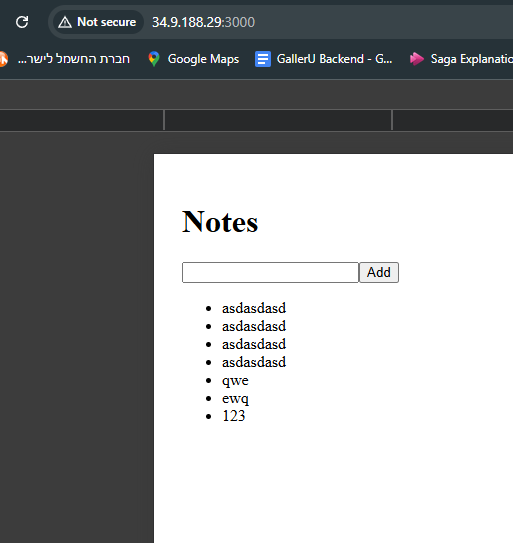
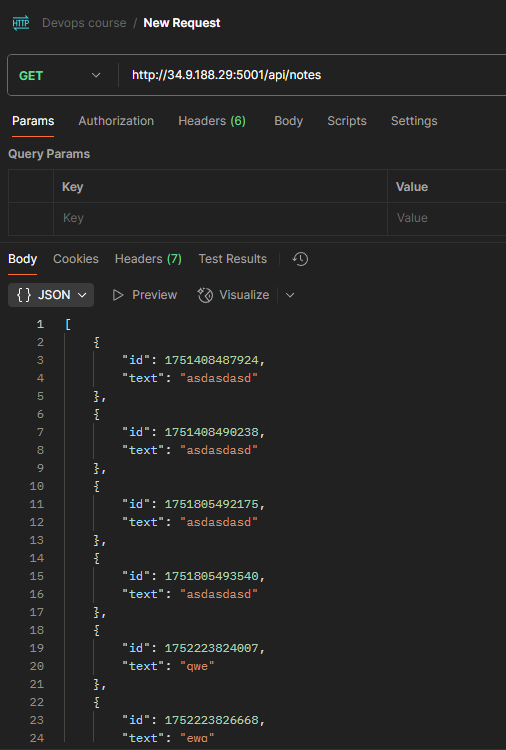
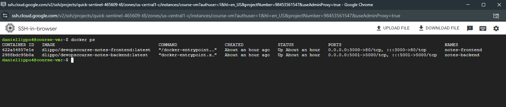

# App deployment:

1. Create a **VM** in **GC Compute Engine**. Make sure **http traffic** is allowed in **Networking**.
2. Create a firewall rule with target tag `notes-app`, add `0.0.0.0/0` to **IPv4 ranges** and allow `3000,5001` ports. Apply this tag in **VM's settings**.
3. Install **Docker** on the **VM** and create a **network**.
4. Pull and run **BE**, **FE**.

The result should be identical to the images below

